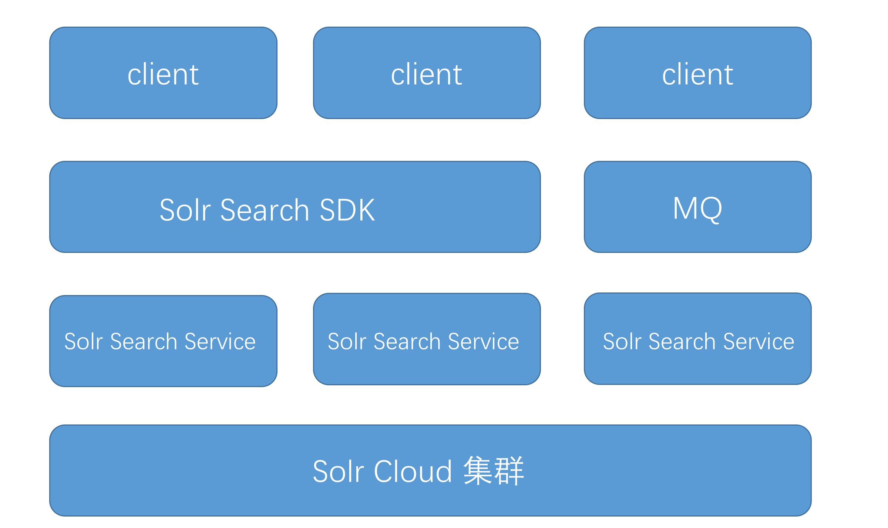

# 全文检索服务使用文档

## 安装SDK

### Maven

```
<dependency>
    <groupId>com.github.guolf</groupId>
    <artifactId>solr-sdk</artifactId>
    <version>0.0.5</version>
</dependency>
```

### Gradle

```
compile "com.github.guolf:solr-sdk:0.0.5"
```

## 运行搜索服务

```
cd search
mvn clean package -Dmaven.test.skip=true
```

## 技术架构

全文搜索服务底层基于SolrCloud。SolrCloud是一个基于Zookeeper和Solr的分布式解决方案，为Solr添加分布式功能，用于建立高可用，高伸缩，自动容错，分布式索引，分布式查询的Solr服务器集群。



## 外部系统接口设计


* 查询接口

	查询接口提供 HTTP 的调用方式，当出现跨机房访问的时候，请使用 HTTP 接口，其余都可以使用 Dubbo RPC 调用

* 更新接口

	数据更新接口采用提供 MQ 的方式接入。当业务方出现数据更新的时候，只需将数据推送到对应的 MQ 通道中即可。更新服务会监听每个业务方通道，及时将数据更新到 Solr 中


## 使用

### 创建索引

* 提供MQ、HTTP方式创建索引，推荐使用MQ
* 初始化时设置接口服务器地址
	
```
SolrRequestService<TestContent> requestService = SolrRequestService.getInstance();
requestService.setBaseUrl("http://localhost:8080/"); // 索引服务接口地址
```

* 在需要创建索引的字段上添加注解：主键: `@SolrField(type = FieldType.PRIMARY)`,文件:`@SolrField(type = FieldType.FILE)`,普通字段添加`@SolrField`即可。

```
package com.jxtii.solr.entity;

import com.google.gson.annotations.SerializedName;
import com.jxtii.solr.annotation.FieldType;
import com.jxtii.solr.annotation.SolrField;

/**
 * Created by guolf on 17/7/9.
 */
public class TestContent {

    @SerializedName("id")
    @SolrField(type = FieldType.PRIMARY)
    private String newsId;

    @SolrField
    private String newsTitle;

    @SolrField
    private String newContent;

    @SolrField(type = FieldType.FILE)
    private String filePath;

    public String getNewsId() {
        return newsId;
    }

    public void setNewsId(String newsId) {
        this.newsId = newsId;
    }

    public String getNewsTitle() {
        return newsTitle;
    }

    public void setNewsTitle(String newsTitle) {
        this.newsTitle = newsTitle;
    }

    public String getNewContent() {
        return newContent;
    }

    public void setNewContent(String newContent) {
        this.newContent = newContent;
    }

    public String getFilePath() {
        return filePath;
    }

    public void setFilePath(String filePath) {
        this.filePath = filePath;
    }

    @Override
    public String toString() {
        return "TestContent{" +
                "newsId='" + newsId + '\'' +
                ", newsTitle='" + newsTitle + '\'' +
                ", newContent='" + newContent + '\'' +
                ", filePath='" + filePath + '\'' +
                '}';
    }
}

```

#### http方式

创建索引返回`OK`表示创建成功，否则返回错误信息。

```
public void testCreateIndexWithFile() {
	SolrRequestService<TestContent> requestService=SolrRequestService.getInstance();
	TestContent testContent = new TestContent();
	testContent.setNewsId("news0709004");
	testContent.setNewsTitle("测试标题");
	testContent.setNewContent("测试内容");
	testContent.setFilePath("http://baidu.com");
	String result = requestService.createIndex(testContent);
	Assert.assertEquals("OK", result);
}

```

#### 队列方式(activemq)

```
// 创建索引
private void testMq() {
	JmsTemplate jmsTemplate = context.getBean(JmsTemplate.class);
	TestContent testContent = new TestContent();
	testContent.setNewsId("news0709004");
	testContent.setNewsTitle("测试标题");
	testContent.setNewContent("测试内容");
	testContent.setFilePath("http://baidu.com");
	jmsTemplate.convertAndSend("solr_create_index_content", testContent);
}

// 创建索引结果监听
@JmsListener(destination = "solr_create_index_result", containerFactory = "myFactory")
public void receiveResultMessage(SolrResult result) {
	System.out.println("Received <" + result + ">");
}

```

### 查询

调用SDK(HTTP)方式

```

public void testCondition1() {
	Criteria crotch = Crotch.where("id").contains("sss").and("title").in("标题");
	QueryParser parser = new QueryParser();
	Assert.assertEquals(parser.createQueryStringFromNode(crotch, 0), "id:*sss* AND title:标题");
}

public void testCondition2() {
	Criteria crotch1 = Crotch.where("id").contains("sss").and("title").in("标题");
	Criteria crotch2 = Crotch.where("id").contains("sss").and("title").startsWith("标题");
	QueryParser parser = new QueryParser();
	Assert.assertEquals(parser.createQueryStringFromNode(crotch1.connect().or(crotch2), 0),
                "(id:*sss* AND title:标题) OR (id:*sss* AND title:标题*)");
    }
    
public void testQuery1() {
	SolrRequestService<TestContent> requestService = SolrRequestService.getInstance();
	requestService.setBaseUrl("http://localhost:8080/");
	Criteria crotch = Criteria.where("id").in("news0709004");
	QueryCondition condition = new QueryCondition();
	condition.setKeywords(new QueryParser().createQueryString(crotch));
	SolrResult<List<TestContent>> solrResult = requestService.query(condition, TestContent.class);
	Assert.assertEquals(solrResult.getData().get(0).getNewsId(), "news0709004");
}
```

Dubbo方式

```
<?xml version="1.0" encoding="UTF-8"?>
<beans xmlns="http://www.springframework.org/schema/beans"
       xmlns:xsi="http://www.w3.org/2001/XMLSchema-instance"
       xmlns:dubbo="http://code.alibabatech.com/schema/dubbo"
       xsi:schemaLocation="http://www.springframework.org/schema/beans
       http://www.springframework.org/schema/beans/spring-beans.xsd
       http://code.alibabatech.com/schema/dubbo http://code.alibabatech.com/schema/dubbo/dubbo.xsd">

    <!-- 消费方应用名，用于计算依赖关系，不是匹配条件，不要与提供方一样 -->
    <dubbo:application name="search_demo" />
    <!-- 使用multicast广播注册中心暴露发现服务地址 -->

    <dubbo:registry protocol="zookeeper" address="zookeeper://localhost:2181" />
    
    <!-- 生成远程服务代理，可以和本地bean一样使用demoService -->
    <dubbo:reference id="solrService" interface="com.jxtii.solr.api.ISolrService" version="1.0.0" check="false" />
    
</beans>
```

```
@Autowired
private ISolrService solrService;
...
QueryCondition condition = new QueryCondition();
Criteria criteria = Criteria.where("entityName").in("Article");
condition.setKeywords(new QueryParser().createQueryString(criteria));

SolrResult<List<Map<String,Object>>> result = solrService.query(condition);

...
```

### 删除索引

```
public void testDelete() {
	SolrRequestService<TestContent> requestService = SolrRequestService.getInstance();
	String result = requestService.deleteById("news0709004");
	Assert.assertEquals(result, "OK");
}
```